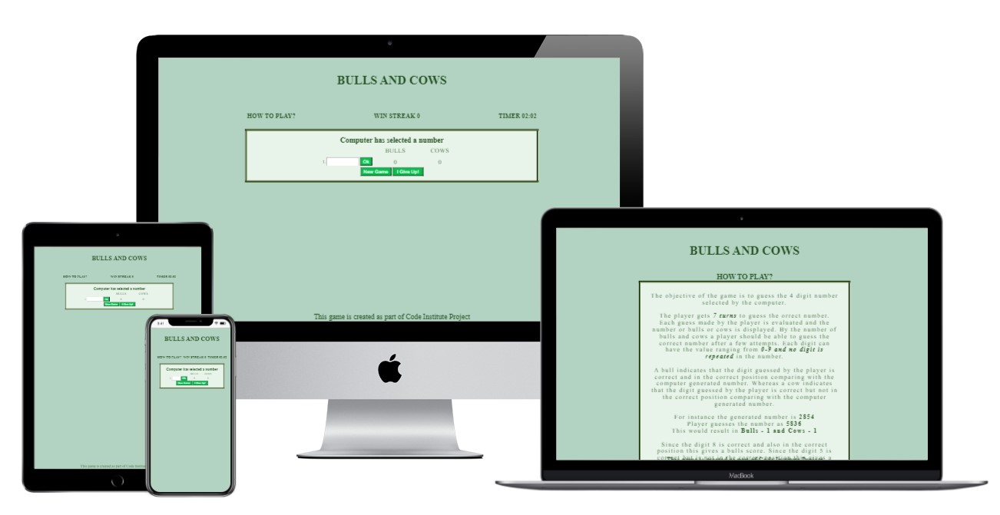

# Bulls and Cows Game  

Bulls and Cows is an ancient logical game. The game logic is developed using JavaScript as part of Portfolio Project for Code Institute.  

[View deployed site here](https://pradnya144.github.io/Portfolio-Project-2/)   

  


## Table of Contents  

* [User Experience (UX)](#User-Experience-(UX))  
* [Design](#Design)  
* [Features](#Features)  
* [Technologies](#technologies)  
* [Testing](#Testing)  
* [Deployment](#Deployment)  
* [Acknowledgements & Credit](#Acknowledgements-&-Credit)  


## User Experience (UX)  

### User Story  

User stories were created to help guide the design and implementation phases of the project and to ensure the needs of each stake holder are undestood.  

* New Player Goals  
   * As a new player:  
     * I want to understand the rules and how to play the game.  
     * I want the interface to be simple and easy to navigate.  

* Seasoned Player Goals  
   * As a player who has played this game before:  
     * I want to be able to directly start playing the game.  
     * I want the interface to be simple and clear as should be for a logical game.  


### Structure

The game interface consists of 2 pages.

* A landing page or the main game page having the main game area where user enters inputs and sees reults, a timer and winstreak. Also a tab to view the instructions.  
* An instructions page having the rules of the game with examples.  

### Future Advancements  

More difficulty levels and complexities can be added to the game play, challenging the player even more.   
More setting options and personilization for player can be added to the game.  


## Design

### Colour  

Considering this being a logical game, I have kept the colour scheme quite neutral. I have chosen shades of green to keep the website soothing on the eyes. I have chosen shades of green off different palettes that I think would go together.  
I have used https://coolors.co/ to generate the palette.  
  
  

### Font  

I have used the default font in the browser and not modified it. I have used style like bold and weight to emphasise certain areas of the text.  

### Wireframe  

I have used a basic microsoft word document to create a mock up for the game layout.  The mock up helped in designing the layout of the webpage and colour theme.  

  

## Features  

1. The name of the game is visible on both the pages and has a maintained style throughout.  
    * The name of the game is big and clearly visible.  
    * There is one clickable link for "HOW TO PLAY" page on the menu board.  
    * The main page also displayes the players wins and the timer for each round of the game.  

  

2. The main page contains the game area with which the player interacts.  
    * The hero imaage is chosen appropriate to the aquarium theme and covers all of the page.
    * There is a section which contains the computers generated number which is kept hidden.  
    * There is and input area where the player can input their guess.  
    * An "OK" button which triggers the user input and answer comparison and generates and displays the bulls and cows score.  
    * For each chance the user fails to guess the correct number, a new input field is added below.  
    * The player has the option of 'Quitting' the game or also selecting a 'New game'.  

  

3. The game play instructions page is a clickable link "HOW TO PLAY?"  
    * The style and colour scheme on this page is consistent with the main game play page.  
    * This page contains text for instructions on how to play the game.  
    * There are examples given for better understanding of the game.  
    * There is a link present to go back to the game page and start playing the game.  

  


## Technologies  

### Languages used  

* JavaScript  
* HTML5  
* CSS3  

### Frameworks, Libraries and Programs used

1. Google Fonts:  
    * Google fonts import statements were used as part of this project to make use of the fonts which are used on all pages of the website.   
2. Gitpod:  
    * Gitpod IDE was used for writing and editing code and version control.  
3. GitHub:  
    * GitHub is used to store the projects code after being pushed from Git.  
4. Formatting:  
    * The css file was passed through https://beautifier.io/ for a consistent formatting throughout the code.  


## Testing  

Since the website is built with HTML and CSS and JavaScript, I have made use of the [W3C Markup Validation Service](https://validator.w3.org/) and [W3C CSS Validation Service](https://jigsaw.w3.org/css-validator/validator.html.en) to validate HTML and CSS syntax in this project.  
Both tests **Pass**  

### Lighthouse Testing  

The result for lighthouse testing was as below.  

  

### Test Cases

| ID | Test Name | Steps | Expected Outcome | Result |  
|----|-----------|-----|----------|----|  
| T01 | Navigation-Clickable | Click on the "HOW TO PLAY" | The link redirects to the correct page when clicked | Pass |  
| T02 | Navigation-Clickable | Click on the "click here to start playing" link | This shhould redirect back to the main game page | Pass |  
| T03 | UX- Responsiveness | Repeat all the above tests for desktops, tablets and smartphone sizes | Screen should re-size so that text remains visible and all the items on the screen should position appropriately | Pass |  
| T04 | Game-logic | Enter value and compare with answer | The number of cows and bulls score displayed should be correct | Pass |  
| T05 | Game-logic | Click new game to start playing again | The game board should reset to original | Pass |  

### Browser Testing  

The website was viewed on
* Google Chrome  
* Microsoft Edge  
* Mozilla Firefox  
* Safari  

### Smartphone, Tablet Testing  

The website was viewed on  
* Samsung Galaxy A70  
* Samsung Galaxy A7
* iPhone SE
* iPad Air 2020  

### Known Bugs  

Even after quitting the game the user can still input values. I have not been able to restrict the user input after quitting the game.  
The Alert message ok click, sometimes adds new rows in the middle of the game.  

## Deployment

### Github Pages

This project was developed using the Gitpod IDE and pushed to a Github repository with the use of Git version control.
The project was deployed to GitHub Pages using the following steps.  
1. Login to Github and open the Github Repository.  
2. Within the Repository click on "Settings" from the top menu.  
3. Go to the "Pages" section.  
4. Under the Sources click the dropdown displaying None and select the branch to be deployed ("Main").  
5. Click on the "Save" button.  
6. Deployed link is now generated at the top.  

The website can directly be viewed using this link now.  

### Forking Github Repository

To make a copy of the original repository to make changes to it without affecting the original repository follow the below steps.  
1. Login to Github and open the Github Repository.    
2. Within the Repository click on the "Fork" at the right top corner.   

This would have created the same repository in your account.  

Make changes to the project and push those changes back to Github using the below commands.  
````
git add .  
git commit -m "commit message"  
git push  
````  

### Cloning Github Repository

 For creating a clone of this repository follow the below steps.  
1. Login to Github and open the Github Repository.  
2. Click on the Code dropdown above the file list.  
3. Copy the https link shown in the https section.  
4. Open your local terminal/command prompt where git is installed.  
5. Navigate to the location where you want to clone the repository.  
6. Type the command   
     ````
    git clone https://github.com/Pradnya144/Portfolio-Project-2.git  
    ````   
The repository is cloned and ready to use.  


## Acknowledgements & Credits

I have looked at a lot javascript DOM methods examples on [W3School](https://www.w3schools.com/) for adding rows to the table, modifying text context and timer controls.  
I have looked at a lot of questions and suggestions on [stackoverflow](https://stackoverflow.com/) for timer, adding rows and also clearing child nodes. 
Ger, from tutor support has helped me identify the root cause of the issue with my empty input value on resetting the game and with correcting the eventlisteners.     
My mentor Brian Macharia, has given me valuable feedback and input during every stage of development of this project.  